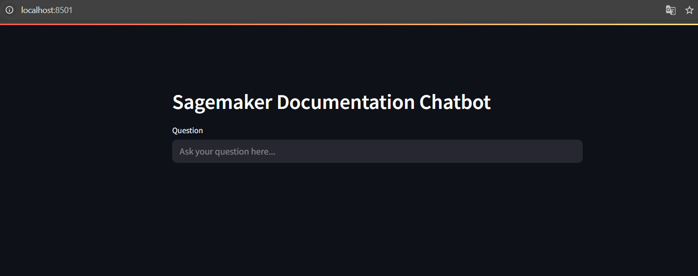
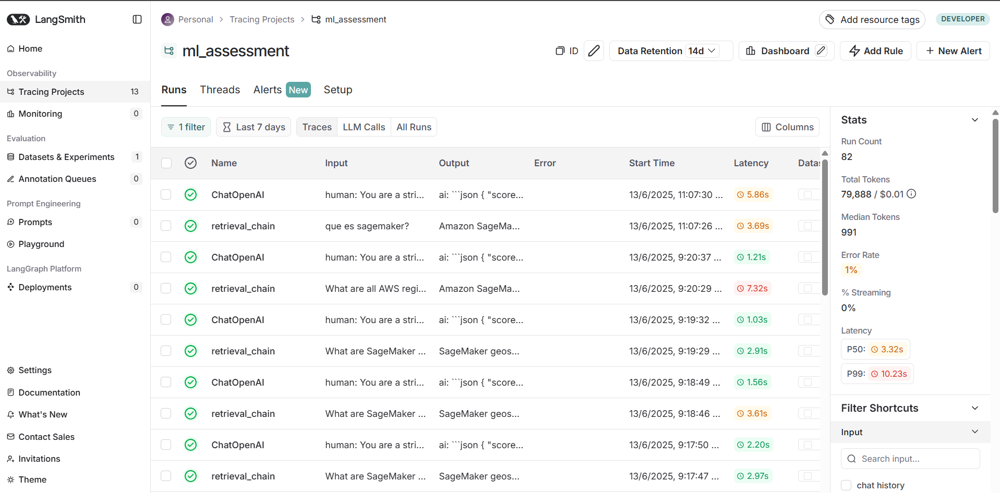
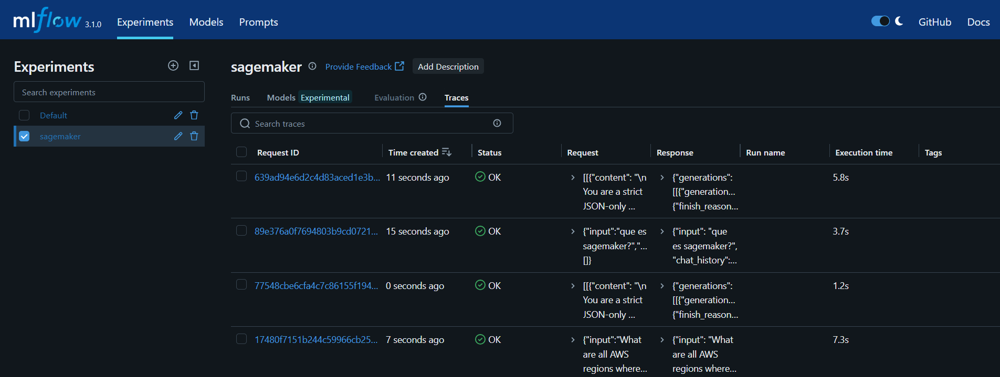
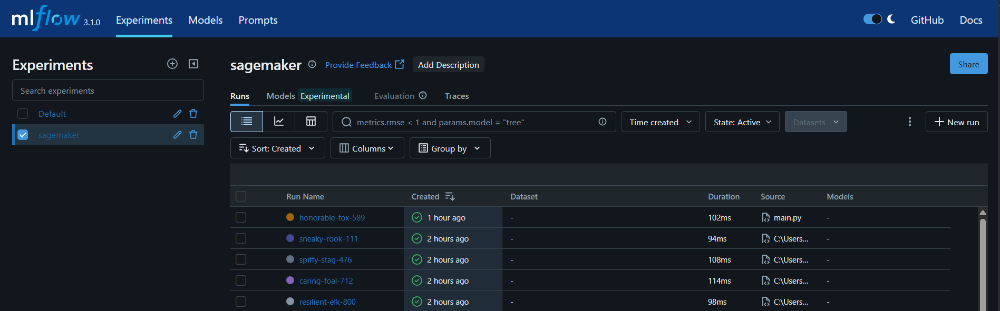
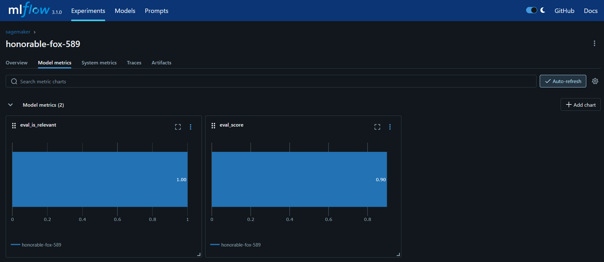

# 🧠 ChatBot Documentation System

## About the respository
This repository contains the source code for a chatbot that uses OpenSearch (AWS Knowledge base) and OpenAI to answer questions about SageMaker documentation

## How to use the repository
### Step 1: General configurations
1. Create a .env file in the root directory of the repository
2. Add the following variables to the .env file:
    - **OPENAI_API_KEY**: The OpenAI API key
    - **LANGCHAIN_API_KEY**: LangChain API key
    - **LANGCHAIN_TRACING_V2**: LangChain tracing version
    - **LANGCHAIN_PROJECT**: LangChain project name
    - OPENSEARCH_INITIAL_ADMIN_PASSWORD: The initial password for the OpenSearch (admin)

### Step 2: Install dependencies
1. Install Poetry as described in the [Poetry documentation](https://python-poetry.org/docs/)
2. Run `poetry install` in the root directory of the repository
3. Sometimes the IDE recognize the poetry env, if not you can import it manually by configuring the interpreters in your IDE

### Step 3: Constants configuration (tools/contants.py)
1. Folders of documentation can be changed based on the path of the repository. Set the folder documentation in the root directory of the repository.
    * **LOCAL_DOCS_PATH**: Path of the documentation folder (streamlit chat)
    * **DOCS_LOCATION**: Path of the documentation folder (OpenSearch indexing)
2. MLFLOW: Replace the MLFLOW_TRACKING_URI with your MLFLOW tracking URI and run in terminal `mlflow ui`

**🚨 NOTE**  
Before execution of the chatbot, change in the constants file the model you desire to use. e.g.
`MODEL_LLM = "gpt-3.5-turbo" or "gpt-4"` and `MODEL_EMBEDDING = "text-embedding-3-small"`'

### Step 4: OpenSearch configuration
1. Run `docker-compose up -d` in the root directory of the repository to start OpenSearch (this can be change if you use AWS knowledge base)
2. Wait for OpenSearch to start
3. Run `python indexing/create_index.py` in the root directory of the repository to create the index in OpenSearch
4. Run `python indexing/indexing.py` in the root directory of the repository to index the docs in OpenSearch

### Step 5: Run the chatbot
Run `streamlit run main.py` in the root directory of the repository. It opens the chatbot in the browser with following url: http://localhost:8501/. The frontend looks like this:

  

### Step 6: Tracing in LangSmith and MLFlow
1. For each question, langSmith store a tracing in the following URL https://www.langchain.com/langsmith. The user can start with a GitHub user or sing up in the web app. The langSmith looks like this:

  

2. With `mlflow.langchain.autolog` you can see the tracing in the MLFlow UI for each experiment (name) in the **Traces** section. The MLFlow looks like this:

  

3. The evaluator's responses are being stored as an independent run for each question (they can also be seen in trace)

  

  

